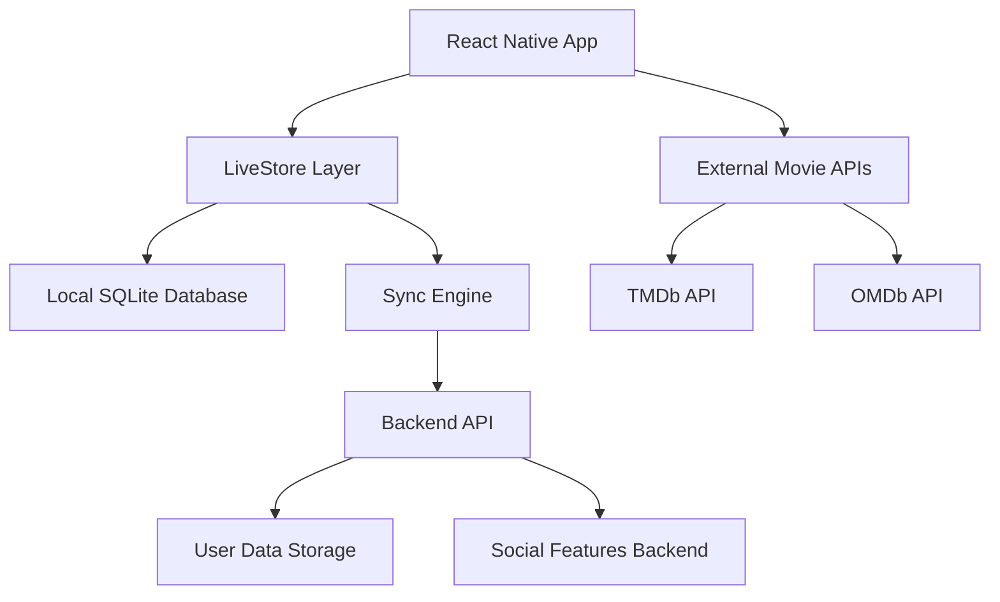

# Design Document

## Overview

Moots is a local-first, social movie curation platform built on React Native with Expo, leveraging LiveStore for offline-first reactive data management. The platform enables users to create and share curated movie lists, discover content through community-driven recommendations, and engage with fellow movie enthusiasts. The architecture prioritizes offline functionality while maintaining seamless synchronization when connectivity is available.

## Architecture

### High-Level Architecture



### Technology Stack

- **Frontend**: React Native with Expo
- **State Management**: LiveStore (offline-first reactive data management)
- **Local Storage**: SQLite via LiveStore
- **External APIs**: TMDb (The Movie Database), OMDb (Open Movie Database)
- **UI Components**: React Native Paper (already integrated)
- **Navigation**: Expo Router (already configured)
- **Networking**: Expo's fetch with offline queue management

### Data Flow Architecture

The application follows a local-first approach where all user interactions happen against local data, with background synchronization handling server updates. This ensures consistent performance regardless of network conditions.

## Components and Interfaces

### Core Data Models

#### User Model
```typescript
interface User {
  id: string;
  username: string;
  email: string;
  profilePicture?: string;
  bio?: string;
  interests: string[];
  isPublic: boolean;
  followersCount: number;
  followingCount: number;
  listsCount: number;
  createdAt: Date;
  updatedAt: Date;
}
```

#### MovieList Model
```typescript
interface MovieList {
  id: string;
  userId: string;
  title: string;
  description?: string;
  isPublic: boolean;
  category?: string;
  movieIds: string[];
  likesCount: number;
  commentsCount: number;
  createdAt: Date;
  updatedAt: Date;
}
```

#### Movie Model
```typescript
interface Movie {
  id: string; // IMDb ID for deduplication
  title: string;
  year: number;
  genre: string[];
  director: string[];
  cast: string[];
  plot: string;
  poster: string;
  imdbRating: number;
  tmdbRating: number;
  runtime: number;
  language: string;
  country: string;
  streamingAvailability?: StreamingProvider[];
  createdAt: Date;
  updatedAt: Date;
}
```

#### UserMovieRating Model
```typescript
interface UserMovieRating {
  id: string;
  userId: string;
  movieId: string;
  rating: number; // 1-5 stars
  notes?: string;
  listId: string; // Which list this rating belongs to
  createdAt: Date;
  updatedAt: Date;
}
```

#### Social Interaction Models
```typescript
interface Follow {
  id: string;
  followerId: string;
  followingId: string;
  createdAt: Date;
}

interface ListLike {
  id: string;
  userId: string;
  listId: string;
  createdAt: Date;
}

interface ListComment {
  id: string;
  userId: string;
  listId: string;
  content: string;
  createdAt: Date;
  updatedAt: Date;
}
```

### Service Layer Architecture

#### MovieService
Handles all movie-related operations including search, metadata fetching, and caching.

**Key Responsibilities:**
- Search movies via external APIs (TMDb/OMDb)
- Cache movie metadata locally
- Handle API rate limiting and fallback strategies
- Deduplicate movies using IMDb ID

**Design Rationale:** Centralizing movie operations ensures consistent data handling and efficient API usage while providing offline fallback capabilities.

#### ListService
Manages movie list operations with offline-first approach.

**Key Responsibilities:**
- CRUD operations for movie lists
- Handle offline list modifications
- Sync list changes when online
- Manage list privacy settings

#### SocialService
Handles user interactions and community features.

**Key Responsibilities:**
- Follow/unfollow operations
- Like and comment functionality
- Activity feed generation
- Notification management

#### SyncService
Manages data synchronization between local and remote storage.

**Key Responsibilities:**
- Queue offline changes
- Resolve sync conflicts using last-write-wins
- Handle network state changes
- Batch sync operations for efficiency

**Design Rationale:** Separating sync logic allows for sophisticated conflict resolution and ensures data consistency across devices.

### Screen Architecture

#### Navigation Structure
```
App
├── (container)
│   ├── (auth)
│   │   ├── signin
│   │   └── signup
│   └── (tabs)
│       ├── index (Home/Today's Picks)
│       ├── explore (Browse Lists/Users)
│       ├── my-lists
│       ├── profile
│       └── settings
├── movie-details/[id]
├── list-details/[id]
├── user-profile/[id]
└── create-list
```

#### Key Screen Components

**Home Screen (Today's Picks)**
- Displays trending movies added in last 24 hours
- Implements filtering by genre, popularity, recency
- Shows aggregated statistics for duplicate movies
- Handles offline state with cached data

**Explore Screen**
- User directory with search functionality
- Public lists discovery
- Genre-based browsing
- Infinite scroll with pagination

**My Lists Screen**
- Personal list management
- Quick actions for create/edit/delete
- Offline editing capabilities
- Sync status indicators

## Data Models

### LiveStore Schema Design

The LiveStore schema is designed to support offline-first operations with efficient querying and synchronization.

#### Primary Tables
- `users` - User profiles and metadata
- `movie_lists` - User-created movie lists
- `movies` - Cached movie metadata
- `list_movies` - Many-to-many relationship between lists and movies
- `user_movie_ratings` - User ratings and notes for movies
- `follows` - User follow relationships
- `list_likes` - List like interactions
- `list_comments` - Comments on public lists
- `daily_picks` - Cached trending movies for offline access

#### Indexing Strategy
- Primary indexes on all ID fields
- Composite indexes on frequently queried combinations:
  - `(userId, isPublic)` for list discovery
  - `(movieId, userId)` for rating lookups
  - `(createdAt, isPublic)` for trending content
  - `(followerId, followingId)` for social queries

**Design Rationale:** The indexing strategy optimizes for the most common query patterns while keeping storage overhead minimal for mobile devices.

### Caching Strategy

#### Movie Metadata Caching
- Cache all fetched movie data indefinitely
- Use IMDb ID as primary key for deduplication
- Implement LRU eviction for storage management
- Background refresh for frequently accessed movies

#### User Content Caching
- Cache public lists and user profiles for 24 hours
- Implement selective caching based on user interactions
- Priority caching for followed users' content

## Error Handling

### Network Error Handling

#### API Failure Scenarios
1. **External Movie API Unavailable**
   - Fallback to cached movie data
   - Display appropriate user messaging
   - Queue search requests for retry

2. **Sync Service Unavailable**
   - Continue offline operations
   - Queue changes for later sync
   - Show sync status in UI

3. **Rate Limiting**
   - Implement exponential backoff
   - Cache responses aggressively
   - Provide user feedback about delays

### Data Consistency

#### Conflict Resolution
- **Last-Write-Wins Strategy**: Simple and predictable for most use cases
- **User Notification**: Inform users when conflicts are resolved
- **Backup Strategy**: Keep conflict versions for manual resolution if needed

**Design Rationale:** Last-write-wins is chosen for simplicity and user experience. Most conflicts in movie list management are not critical enough to require complex resolution strategies.

#### Validation
- Client-side validation for immediate feedback
- Server-side validation for data integrity
- Graceful handling of validation failures

### User Experience Error Handling

#### Offline State Management
- Clear indicators when app is offline
- Disable features that require network connectivity
- Show cached data age for transparency

#### Loading States
- Skeleton screens for content loading
- Progressive loading for large lists
- Optimistic updates for user actions

## Testing Strategy

### Unit Testing
- **Service Layer**: Comprehensive testing of business logic
- **Data Models**: Validation and transformation testing
- **Utility Functions**: Edge case coverage

### Integration Testing
- **LiveStore Operations**: Database interactions and sync
- **API Integration**: External service mocking and error scenarios
- **Offline Scenarios**: Network state simulation

### End-to-End Testing
- **Critical User Flows**: List creation, movie search, social interactions
- **Offline/Online Transitions**: Data consistency verification
- **Cross-Device Sync**: Multi-device scenario testing

### Performance Testing
- **Database Query Performance**: Large dataset scenarios
- **Memory Usage**: Long-running app sessions
- **Network Efficiency**: API call optimization

**Design Rationale:** The testing strategy focuses on the most critical aspects of the offline-first architecture, ensuring data consistency and user experience quality across network conditions.

### Testing Tools
- **Jest**: Unit and integration testing
- **Detox**: End-to-end testing for React Native
- **Flipper**: Performance monitoring and debugging
- **Custom Network Simulation**: Offline scenario testing

## Security Considerations

### Data Privacy
- User data encryption at rest
- Secure API key management
- Privacy controls for user profiles and lists

### API Security
- Rate limiting implementation
- API key rotation strategy
- Secure storage of authentication tokens

### Social Features Security
- Content moderation capabilities
- Spam prevention mechanisms
- User blocking and reporting features

## Performance Optimizations

### Database Performance
- Efficient indexing strategy
- Query optimization for common operations
- Pagination for large datasets

### Network Performance
- Request batching for sync operations
- Image caching and optimization
- Compression for API responses

### UI Performance
- Lazy loading for lists and images
- Virtualized lists for large datasets
- Optimized re-rendering strategies

This design provides a solid foundation for building a robust, offline-first social movie platform that meets all the specified requirements while maintaining excellent user experience across various network conditions.